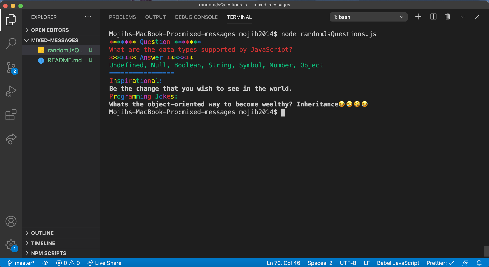

# JavaScript Basic questions and answers, and programming jokes

## introdcution:

A random JavaScript basic questions and answers, Inspirational and programmings jokes generator.

## Technologies:

JavaScript/ES6
Node version -v12.18.0

## setup

To run this project locally in your pc or make it yours:

`$ git clone https://github.com/ mojib2014/git_practice.git`

`$ cd mixMessagGenerator`

`$ npm install`
